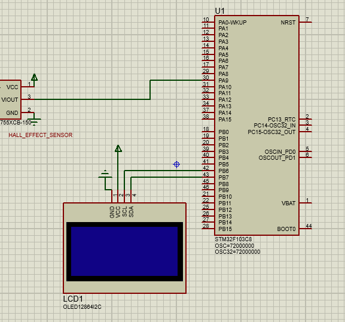

# ⭐STM32-Based-Speedometer-Hall-Sensor-OLED-
A digital speedometer built using an STM32 microcontroller, Hall-effect sensor, and OLED display (SSD1306 I2C).
A neodymium magnet is fixed on the vehicle’s rear sprocket. Each rotation triggers an interrupt through the Hall sensor, and the STM32 calculates vehicle speed based on pulse count.

## 💠Hardware used
1)STM32F103C8T6 (Bluepill)

2)Hall Effect Sensor (e.g., A3144)

3)Neodymium Magnet attached to chain sprocket

4)0.96” OLED Display (SSD1306, I2C)

## 💠Wroking Priciple
•Magnet rotates with the wheel.
•Hall sensor outputs 1 pulse per rotation.

•STM32 counts pulses using EXTI interrupt on rising edge.

•Every 500 ms, pulse count is sampled.

•Speed is computed using wheel circumference.

•Speed is updated on OLED in km/h.

## 💠Speed Calculation
=>Wheel radius chosen: 0.1651 m (≈ 13 inch wheel)

=>wheel_circ = 2 × π × r

=>speed (m/s) = pulse_count × wheel_circ × 2   // ×2 because 500ms

=>speed (km/h) = speed (m/s) × 3.6

## 💠Code Flow Summary
1)Initialize GPIO(external interrupt, I2C, OLED

2)Configure Hall sensor pin in external interrupt mode (EXTI)

3)In interrupt callback → pulse_count++

4)In main loop:

Reset pulse count-> Delay 500 ms->Calculate speed->Display on oled using SSD1306 library

## 💠Core Code file
=>core/src(.c files)

=>core/inc(.h files)

## 💠schematic
          

